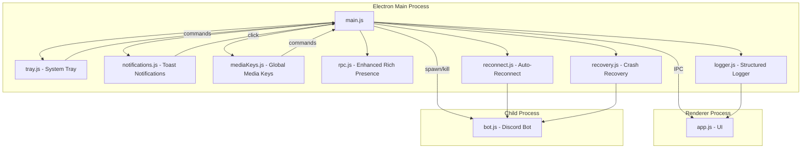

# Design Document: Desktop App Enhancements

## Overview

This design describes the technical approach for enhancing the Scify Music Electron desktop application with Windows system integration, improved Discord Rich Presence, and smart reliability features. The enhancements transform the app from a basic window-based controller into a polished native-feeling desktop experience with resilient operation.

The implementation adds six major subsystems to the existing `desktop/main.js` architecture:

1. **System Tray Integration** — minimize-to-tray behavior, tray icon context menu
2. **Toast Notifications** — native Windows notifications on track change
3. **Media Key Support** — global hotkey registration for hardware media keys
4. **Enhanced Rich Presence** — activity type "Listening to", elapsed time, queue info, channel name
5. **Auto-Reconnect** — network detection with exponential backoff reconnection
6. **Crash Recovery & Structured Logging** — automatic bot restart with circuit breaker, timestamped log output

All new modules integrate into the existing Electron main process (`desktop/main.js`) and communicate with the renderer via the established IPC bridge (`desktop/preload.js`).

## Architecture



### Design Decisions

1. **Separate modules per feature** — Each enhancement lives in its own file (`tray.js`, `notifications.js`, etc.) to keep `main.js` manageable and allow independent testing.

2. **Logger wraps console** — The structured logger replaces direct `console.log/warn/error` calls with a unified interface that prepends timestamps and severity tags. All other modules use the logger.

3. **Recovery owns bot lifecycle** — The crash recovery module takes over bot spawning from `main.js`. It wraps the existing `spawnBot()` logic with restart tracking and circuit-breaker logic.

4. **Reconnect uses Electron's built-in net events** — The `electron.net` module's `online`/`offline` events provide reliable network state detection on Windows without additional dependencies.

5. **Media keys use globalShortcut** — Electron's `globalShortcut` module registers system-wide media key handlers. This avoids native addon dependencies.

6. **Tray replaces window close** — The `close` event is intercepted to hide the window instead of quitting. A separate "Exit" action in the tray menu performs actual quit.

## Components and Interfaces

### 1. Logger Module (`desktop/logger.js`)

```javascript
// Public interface
export function createLogger() → Logger

interface Logger {
  info(message: string, context?: object): void
  warn(message: string, context?: object): void
  error(message: string, context?: object): void
  onLogEntry(callback: (entry: LogEntry) => void): void
}

interface LogEntry {
  timestamp: string    // ISO 8601: [YYYY-MM-DDTHH:mm:ss.sssZ]
  level: 'INFO' | 'WARN' | 'ERROR'
  message: string
  context?: object
}
```

### 2. System Tray Module (`desktop/tray.js`)

```javascript
// Public interface
export function createTray(options: TrayOptions) → TrayManager

interface TrayOptions {
  iconPath: string
  window: BrowserWindow
  onPlay: () => void
  onPause: () => void
  onSkip: () => void
  onOpen: () => void
  onExit: () => void
}

interface TrayManager {
  updateNowPlaying(title: string | null): void
  destroy(): void
}
```

### 3. Notifications Module (`desktop/notifications.js`)

```javascript
// Public interface
export function showNowPlayingNotification(options: NotifOptions) → void

interface NotifOptions {
  title: string
  onActivated: () => void
}
```

### 4. Media Keys Module (`desktop/mediaKeys.js`)

```javascript
// Public interface
export function registerMediaKeys(handlers: MediaKeyHandlers) → void
export function unregisterMediaKeys() → void

interface MediaKeyHandlers {
  onPlayPause: () => void
  onNextTrack: () => void
  onPreviousTrack: () => void
}
```

### 5. Enhanced Rich Presence (`desktop/rpc.js` — modified)

```javascript
// Updated interface (extends existing rpc.js)
export async function updatePresence(options: PresenceOptions) → void

interface PresenceOptions {
  title: string
  positionSec: number
  durationSec: number
  paused: boolean
  channelName?: string     // NEW: voice channel name
  queueLength?: number     // NEW: remaining tracks in queue
}
```

### 6. Auto-Reconnect Module (`desktop/reconnect.js`)

```javascript
// Public interface
export function createReconnectManager(options: ReconnectOptions) → ReconnectManager

interface ReconnectOptions {
  logger: Logger
  onStatusChange: (status: 'online' | 'offline' | 'reconnecting') => void
  onReconnect: () => Promise<void>
  maxRetries: number       // default: 5
  baseDelay: number        // default: 5000ms
  maxDelay: number         // default: 60000ms
}

interface ReconnectManager {
  start(): void
  stop(): void
  getStatus(): 'online' | 'offline' | 'reconnecting'
}
```

### 7. Crash Recovery Module (`desktop/recovery.js`)

```javascript
// Public interface
export function createRecoveryManager(options: RecoveryOptions) → RecoveryManager

interface RecoveryOptions {
  logger: Logger
  spawnBot: () => ChildProcess
  onStatusChange: (status: string) => void
  crashThreshold: number   // default: 3
  crashWindow: number      // default: 60000ms
  restartDelay: number     // default: 3000ms
}

interface RecoveryManager {
  start(): ChildProcess
  stop(): void
  isCircuitOpen(): boolean
  getProcess(): ChildProcess | null
}
```

### IPC Extensions (preload.js additions)

```javascript
// New IPC channels exposed to renderer
window.scify = {
  ...existingAPI,
  
  // Network/reconnect status
  onNetworkStatus: (callback) => void,  // 'online' | 'offline' | 'reconnecting'
  
  // Crash recovery status
  onCrashRecovery: (callback) => void,  // { event: 'crash' | 'restart' | 'circuit-open', ... }
}
```

## Data Models

### LogEntry

```javascript
{
  timestamp: "[2024-01-15T10:30:45.123Z]",
  level: "[INFO]",       // or [WARN], [ERROR]
  message: "Bot process started",
  context: {             // optional structured data
    exitCode: 1,
    retryCount: 2
  }
}
```

### Formatted Log Output

```
[2024-01-15T10:30:45.123Z] [INFO] Bot process started
[2024-01-15T10:30:48.456Z] [WARN] Network connection lost
[2024-01-15T10:30:53.789Z] [ERROR] Bot crashed { exitCode: 1, retryCount: 1 }
```

### CrashRecord

```javascript
{
  timestamp: Date.now(),   // when the crash occurred
  exitCode: number         // process exit code
}
```

### ReconnectState

```javascript
{
  status: 'online' | 'offline' | 'reconnecting',
  retryCount: number,
  nextRetryDelay: number,  // current backoff delay in ms
  lastGuildId: string,     // guild to rejoin
  lastChannelId: string    // channel to rejoin
}
```

### TrayMenuState

```javascript
{
  currentSong: string | null,  // currently playing song title
  isPlaying: boolean
}
```

### PresenceData (Enhanced)

```javascript
{
  title: string,
  positionSec: number,
  durationSec: number,
  paused: boolean,
  channelName: string,     // e.g. "Music Room"
  queueLength: number      // e.g. 5 remaining tracks
}
```


## Correctness Properties

*A property is a characteristic or behavior that should hold true across all valid executions of a system—essentially, a formal statement about what the system should do. Properties serve as the bridge between human-readable specifications and machine-verifiable correctness guarantees.*

### Property 1: Log output formatting

*For any* log message string and any severity level (INFO, WARN, ERROR), the formatted output SHALL match the pattern `[YYYY-MM-DDTHH:mm:ss.sssZ] [LEVEL] message` where the timestamp is a valid ISO 8601 date and LEVEL is one of INFO, WARN, or ERROR.

**Validates: Requirements 8.1, 8.2**

### Property 2: Log routing by severity

*For any* bot process output string, if it originates from stdout it SHALL be logged with INFO severity, if it originates from stderr it SHALL be logged with WARN severity, and if it represents a crash recovery or reconnect event it SHALL be logged with ERROR severity including context data (exit code or retry count).

**Validates: Requirements 8.3, 8.4, 8.5**

### Property 3: Tray menu displays current song title

*For any* non-empty song title string, calling `updateNowPlaying(title)` SHALL result in the first menu item's label being equal to the provided title string.

**Validates: Requirements 2.7**

### Property 4: Notification content includes song title

*For any* song title string, the toast notification SHALL contain that song title and the text "Playing in Discord VC" in its body.

**Validates: Requirements 3.1**

### Property 5: Rich Presence details field contains title

*For any* song title string (up to 128 characters), the Rich Presence activity's `details` field SHALL contain the title. For titles exceeding 128 characters, the details field SHALL contain a truncated version ending with "…".

**Validates: Requirements 5.2**

### Property 6: Rich Presence elapsed time calculation

*For any* positionSec value (non-negative integer), when the track is not paused, the Rich Presence `startTimestamp` SHALL equal `Date.now() - (positionSec * 1000)` (within a reasonable clock tolerance of ±100ms).

**Validates: Requirements 5.3**

### Property 7: Rich Presence state field formatting

*For any* voice channel name and queue length, the Rich Presence state field SHALL include the channel name. When queueLength is a positive integer, the state SHALL also include the queue count. When queueLength is 0, the state SHALL contain only the channel name with no queue information.

**Validates: Requirements 5.4, 5.5, 5.6**

### Property 8: Exponential backoff delay calculation

*For any* retry count (non-negative integer), the computed delay SHALL equal `min(5000 * 2^retryCount, 60000)` — starting at 5 seconds and capping at 60 seconds.

**Validates: Requirements 6.3**

### Property 9: Non-zero exit code triggers restart

*For any* non-zero integer exit code from the Bot_Process, the crash recovery module SHALL schedule a restart after a 3-second delay.

**Validates: Requirements 7.1**

### Property 10: Circuit breaker opens on rapid crashes

*For any* sequence of crash timestamps, if 3 or more timestamps fall within a 60-second sliding window, the circuit breaker SHALL open (blocking further restarts). If fewer than 3 timestamps fall within any 60-second window, the circuit breaker SHALL remain closed (allowing restarts).

**Validates: Requirements 7.3**

### Property 11: Crash events logged with context

*For any* crash event with an exit code and timestamp, the Logger SHALL produce an entry with ERROR severity that includes both the exit code value and a valid ISO 8601 timestamp.

**Validates: Requirements 7.4**

## Error Handling

### System Tray

| Error Scenario | Handling Strategy |
|---|---|
| Tray icon fails to load | Fall back to default Electron icon; log warning |
| Menu action fails (bot not responding) | Show toast notification to user indicating bot is unresponsive |
| Window restore fails | Re-create window if reference is null |

### Toast Notifications

| Error Scenario | Handling Strategy |
|---|---|
| OS notifications disabled | Silently skip notification; do not register click handler (Req 3.3, 3.4) |
| Notification API throws | Catch error, log warning, continue playback |
| Rapid successive notifications | Debounce — only show notification if last one was >3 seconds ago |

### Media Keys

| Error Scenario | Handling Strategy |
|---|---|
| globalShortcut.register() fails | Log failure, schedule re-attempt on window restore or 60s interval (Req 4.5) |
| Another app holds the shortcut | Log info message; media keys unavailable until released |
| App quit without unregister | Electron handles cleanup automatically on process exit |

### Rich Presence

| Error Scenario | Handling Strategy |
|---|---|
| Discord not running | connectRPC() fails silently; presence updates are no-ops |
| RPC connection drops mid-session | Reconnect on next status poll; log warning |
| setActivity fails | Log warning, don't retry until next track change |
| Title exceeds 128 chars | Truncate with "…" suffix (existing behavior preserved) |

### Auto-Reconnect

| Error Scenario | Handling Strategy |
|---|---|
| Network offline detected | Set status to "reconnecting"; start exponential backoff loop |
| Reconnection attempt fails | Increment retry count; double delay (capped at 60s) |
| 5 consecutive failures | Stop retrying; display error to user (Req 6.4) |
| Bot restart succeeds but VC join fails | Log warning; user can manually trigger rejoin |
| Bot restart fails after network recovery | Do not attempt VC rejoin (Req 6.2) |

### Crash Recovery

| Error Scenario | Handling Strategy |
|---|---|
| Bot exits with non-zero code | Schedule restart after 3s delay (Req 7.1) |
| 3 crashes within 60 seconds | Circuit breaker opens; stop restarts; show error (Req 7.3) |
| Bot exits with code 0 (clean shutdown) | Do not trigger crash recovery; this is intentional stop |
| spawnBot() throws (missing executable) | Log error; do not schedule restart; show error to user |
| Stored settings invalid for rejoin | Log warning; skip VC rejoin; bot remains in started state |

### Logger

| Error Scenario | Handling Strategy |
|---|---|
| Renderer not available for forwarding | Buffer log entries; flush when renderer reconnects |
| Extremely long log messages | Truncate at 4096 characters with "[truncated]" suffix |
| Invalid characters in log message | Sanitize newlines to preserve single-line format |

## Testing Strategy

### Unit Tests (Example-Based)

Unit tests cover specific behaviors, UI interactions, and integration points:

- **Tray module**: Menu construction has correct items (2.1), menu actions call correct handlers (2.2–2.6), Exit disconnects before quit (2.8)
- **Notifications**: Click handler restores window (3.2), disabled notifications don't error (3.3), no click handler when notification skipped (3.4)
- **Media keys**: Each key maps to correct command (4.1–4.3), keys work when minimized (4.4), re-registration on failure (4.5)
- **Rich Presence**: Activity type is "Listening" (5.1), coexistence with "Playing" type (5.7)
- **Reconnect**: Offline event triggers reconnecting status (6.1), online event triggers restart + rejoin (6.2), max retries stops loop (6.4)
- **Crash recovery**: Post-crash rejoin uses stored settings (7.2)
- **Window lifecycle**: Close hides instead of quits (1.1), double-click restores (1.3), bot continues when minimized (1.2)

### Property-Based Tests

Property-based tests validate universal invariants using `fast-check` (JavaScript PBT library).

Each property test runs a minimum of **100 iterations** with random input generation.

**Test Configuration:**
- Library: `fast-check` (npm package)
- Runner: Vitest or Jest
- Minimum iterations: 100 per property
- Tag format: `Feature: desktop-app-enhancements, Property {N}: {title}`

**Properties to implement:**

1. **Log formatting** — Generate random strings and severity levels; verify output format
2. **Log routing** — Generate random output strings; verify severity assignment per source
3. **Tray song title** — Generate random title strings; verify menu label matches
4. **Notification content** — Generate random titles; verify body contains title + "Playing in Discord VC"
5. **RPC details field** — Generate random titles (varying length); verify details field content and truncation
6. **RPC timestamp** — Generate random positionSec values; verify startTimestamp calculation
7. **RPC state formatting** — Generate random channel names + queue lengths; verify conditional formatting
8. **Backoff calculation** — Generate random retry counts; verify delay formula
9. **Restart on non-zero exit** — Generate random non-zero integers; verify restart is scheduled
10. **Circuit breaker** — Generate random crash timestamp sequences; verify open/closed state
11. **Crash logging** — Generate random exit codes; verify ERROR log with context

### Integration Tests

- End-to-end tray lifecycle (show/hide/restore window)
- Bot process spawn/kill lifecycle with crash recovery
- Network offline/online event cycle with reconnection
- Rich Presence connection to Discord IPC

### Test Organization

```
desktop/
├── __tests__/
│   ├── logger.test.js          # Properties 1, 2
│   ├── tray.test.js            # Property 3 + unit tests
│   ├── notifications.test.js   # Property 4 + unit tests
│   ├── rpc.test.js             # Properties 5, 6, 7 + unit tests
│   ├── reconnect.test.js       # Property 8 + unit tests
│   ├── recovery.test.js        # Properties 9, 10, 11 + unit tests
│   └── integration/
│       ├── tray.integration.test.js
│       ├── lifecycle.integration.test.js
│       └── reconnect.integration.test.js
```
