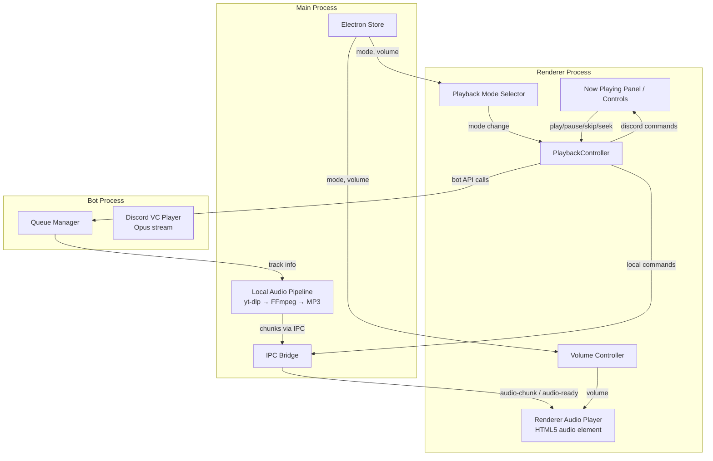

# Design Document: Local Playback

## Overview

The Local Playback feature adds the ability to play music through the user's PC speakers using an HTML5 `<audio>` element in the Electron renderer process, either as an alternative to or simultaneously with the existing Discord voice channel playback.

The current architecture routes all audio through the bot process: `yt-dlp → FFmpeg → Opus → Discord VC`. The local playback feature introduces a parallel audio pipeline in the Electron main process that produces a web-compatible audio format (MP3) and delivers it to the renderer via IPC as a blob URL.

### Key Design Decisions

1. **MP3 output format** — The HTML5 `<audio>` element has universal MP3 support. We transcode to MP3 (128kbps) rather than Opus/OGG to avoid browser compatibility edge cases on Windows.
2. **Blob URL via IPC** — Audio data is streamed from the main process (yt-dlp → FFmpeg → buffer) and sent to the renderer as a complete blob URL. This avoids complex streaming over IPC and keeps the renderer sandboxed.
3. **Chunked transfer** — For responsiveness, the main process sends audio data in chunks via IPC events. The renderer assembles them into a blob and begins playback once enough data arrives (progressive loading).
4. **Mode-aware Playback Controller** — A new `PlaybackController` module in the renderer coordinates actions (play, pause, skip, seek) across the active playback targets based on the selected mode.
5. **Single queue, dual output** — The existing `Queue_Manager` (bot-side) remains the single source of truth for the track queue. The local pipeline simply consumes the same queue entries.

## Architecture



### Data Flow for Local Playback

1. User triggers play (search, queue, auto-advance)
2. `PlaybackController` checks the current mode
3. If mode includes "Local":
   - Sends `local-play` IPC to main process with the track URL
   - Main process spawns `yt-dlp | FFmpeg` pipeline producing MP3
   - Main process sends `audio-chunk` events as data arrives
   - Once all data is received (`audio-complete`), renderer creates a Blob URL
   - Renderer sets `<audio>.src = blobUrl` and calls `.play()`
4. If mode includes "Discord VC":
   - Sends the existing bot API `/play` request as before
5. In "Both" mode, steps 3 and 4 happen concurrently

## Components and Interfaces

### 1. PlaybackModeSelector (Renderer)

A UI component in the settings/now-playing area that lets the user pick between "Discord VC", "Local", and "Both".

```javascript
// State stored in Electron Store
// Key: 'playbackMode', Values: 'discord' | 'local' | 'both'
// Default: 'discord'

// IPC API (via preload)
window.scify.getSettings()    // returns { ..., playbackMode: 'discord' }
window.scify.setSetting('playbackMode', mode)
```

### 2. LocalAudioPipeline (Main Process)

A new module `desktop/localAudio.js` responsible for spawning yt-dlp and FFmpeg to produce MP3 audio data and sending it to the renderer via IPC.

```javascript
// localAudio.js - Main process module
export function createLocalAudioPipeline(mainWindow, settings) {
  return {
    /**
     * Start processing a track for local playback.
     * Spawns yt-dlp → FFmpeg pipeline, streams MP3 chunks to renderer.
     * @param {string} url - YouTube URL or search query
     * @param {number} seekSeconds - Start position in seconds
     */
    play(url, seekSeconds = 0),

    /** Stop and kill any running pipeline processes */
    stop(),

    /** Pause is handled renderer-side (audio element) */

    /** Whether a pipeline is currently active */
    isActive(),
  };
}
```

**IPC Events emitted to renderer:**
- `local-audio-chunk` — `{ chunk: Buffer }` — raw MP3 data chunk
- `local-audio-ready` — `{ durationSec: number }` — all data received, ready to play
- `local-audio-error` — `{ message: string }` — pipeline error

**IPC Messages received from renderer:**
- `local-play` — `{ url: string, seekSeconds?: number }` — start pipeline
- `local-stop` — stop current pipeline

### 3. RendererAudioPlayer (Renderer)

Wraps the HTML5 `<audio>` element and provides a clean interface for the PlaybackController.

```javascript
// rendererAudio.js - Renderer module
class RendererAudioPlayer {
  constructor(audioElement) { ... }

  /** Set source from blob URL and begin playback */
  loadAndPlay(blobUrl)

  /** Pause playback */
  pause()

  /** Resume playback */
  resume()

  /** Seek to position in seconds */
  seek(seconds)

  /** Set volume (0.0 - 1.0) */
  setVolume(level)

  /** Get current position in seconds */
  getPosition()

  /** Get total duration in seconds */
  getDuration()

  /** Stop and reset */
  stop()

  /** Register callback for track ended */
  onEnded(callback)

  /** Register callback for time updates */
  onTimeUpdate(callback)

  /** Register callback for errors */
  onError(callback)
}
```

### 4. PlaybackController (Renderer)

Coordinates all playback actions across the active targets based on the selected mode.

```javascript
// playbackController.js - Renderer module
class PlaybackController {
  constructor({ rendererAudioPlayer, scifyApi, mode }) { ... }

  /** Set the active playback mode */
  setMode(mode) // 'discord' | 'local' | 'both'

  /** Play a track (dispatches to correct targets) */
  async play(trackUrl, trackMeta)

  /** Pause all active targets */
  async pause()

  /** Resume all active targets */
  async resume()

  /** Skip to next track */
  async skip()

  /** Seek to position */
  async seek(seconds)

  /** Stop playback */
  async stop()

  /** Handle track ended from local player */
  handleLocalTrackEnded()
}
```

### 5. VolumeController (Renderer)

A UI slider and logic that controls the local audio volume independently.

```javascript
// Persisted in Electron Store as 'localVolume' (0-100, default 80)
// Maps to audio.volume (0.0 - 1.0) in real time
```

### 6. Preload Bridge Extensions

New IPC channels added to `preload.js`:

```javascript
// New entries in window.scify
localPlay: (url, seekSeconds) => ipcRenderer.invoke('local-play', url, seekSeconds),
localStop: () => ipcRenderer.invoke('local-stop'),
onLocalAudioChunk: (cb) => ipcRenderer.on('local-audio-chunk', (_e, data) => cb(data)),
onLocalAudioReady: (cb) => ipcRenderer.on('local-audio-ready', (_e, data) => cb(data)),
onLocalAudioError: (cb) => ipcRenderer.on('local-audio-error', (_e, data) => cb(data)),
```

## Data Models

### PlaybackMode Enum

```javascript
const PlaybackMode = {
  DISCORD: 'discord',  // Audio only through Discord VC (default, existing behavior)
  LOCAL: 'local',      // Audio only through PC speakers (HTML5 audio)
  BOTH: 'both',       // Audio through both simultaneously
};
```

### Electron Store Schema Additions

```javascript
// Added to the Store defaults in main.js
{
  playbackMode: 'discord',   // PlaybackMode value
  localVolume: 80,           // 0-100 integer
}
```

### LocalAudioState (Main Process internal)

```javascript
{
  ytdlpProcess: ChildProcess | null,
  ffmpegProcess: ChildProcess | null,
  active: boolean,
  currentUrl: string | null,
}
```

### RendererAudioState (Renderer internal)

```javascript
{
  audioElement: HTMLAudioElement,
  blobUrl: string | null,
  chunks: Uint8Array[],      // accumulated MP3 chunks from IPC
  isPlaying: boolean,
  duration: number,          // seconds
  position: number,          // seconds (updated via timeupdate)
}
```

### IPC Message Payloads

```javascript
// local-audio-chunk event payload
{ chunk: ArrayBuffer }  // Raw MP3 bytes

// local-audio-ready event payload
{ durationSec: number }  // Total track duration

// local-audio-error event payload
{ message: string }  // Human-readable error description
```


## Correctness Properties

*A property is a characteristic or behavior that should hold true across all valid executions of a system—essentially, a formal statement about what the system should do. Properties serve as the bridge between human-readable specifications and machine-verifiable correctness guarantees.*

### Property 1: Playback mode routing correctness

*For any* track URL and *for any* playback mode ('discord', 'local', 'both'), the PlaybackController SHALL invoke exactly the correct set of targets: 'discord' invokes only the bot API, 'local' invokes only the local audio pipeline, and 'both' invokes both the bot API and the local audio pipeline.

**Validates: Requirements 1.2, 1.3, 1.4**

### Property 2: Settings persistence round-trip

*For any* valid playback mode value ('discord', 'local', 'both') and *for any* valid local volume value (integer 0–100), persisting the value via Electron Store and then reading it back SHALL return the identical value.

**Validates: Requirements 1.5, 4.4**

### Property 3: Volume clamping and application

*For any* integer volume input, the Volume Controller SHALL clamp it to the range [0, 100], and the resulting audio element volume SHALL equal the clamped value divided by 100.

**Validates: Requirements 4.2, 4.3**

### Property 4: Local seek position accuracy

*For any* seek position within [0, trackDuration], when the user triggers seek in "Local" mode, the Renderer Audio Player's currentTime SHALL equal the requested position (within floating-point tolerance).

**Validates: Requirements 5.4**

### Property 5: Dual-target seek dispatch

*For any* seek position and when mode is 'both', the PlaybackController SHALL dispatch the same seek value to both the Discord VC Player (via bot API) and the Renderer Audio Player.

**Validates: Requirements 5.8**

### Property 6: Queue mode-independence

*For any* queue of tracks, *for any* playback mode, and *for any* queue operation (add track, remove track, switch mode), the queue contents SHALL be unaffected by the current playback mode — adding increases length by 1, removing decreases by 1, and mode switching preserves contents and position.

**Validates: Requirements 6.2, 6.3, 6.4**

### Property 7: Pipeline cleanup on new track

*For any* two consecutive track play requests in local mode, the Local Audio Pipeline SHALL terminate all yt-dlp and FFmpeg child processes from the prior track before spawning new processes for the next track. At no point should more than one set of pipeline processes be active.

**Validates: Requirements 2.4**

### Property 8: Now-playing metadata completeness

*For any* track with title, artist, and thumbnail fields, when that track is playing in "Local" or "Both" mode, the Now Playing Panel's rendered output SHALL contain all three metadata values.

**Validates: Requirements 8.1**

## Error Handling

### Local Audio Pipeline Errors

| Error Scenario | Handling | User Feedback |
|---|---|---|
| yt-dlp fails to fetch audio (network, private video, bot check) | Pipeline emits `local-audio-error` event, kills processes | Error toast: "Could not fetch audio: {reason}" |
| FFmpeg transcoding fails (corrupt stream, codec error) | Pipeline emits `local-audio-error` event, kills processes | Error toast: "Audio processing failed: {reason}" |
| IPC delivery failure | Renderer receives no chunks within 30s timeout | Error toast: "Audio delivery timed out" + auto-skip |
| HTML5 audio element error (decode error, corrupted blob) | Renderer `error` event handler triggers | Error toast: "Playback error" + auto-advance to next track |

### Mode-Specific Error Handling

| Scenario | Behavior |
|---|---|
| Local pipeline fails in "Both" mode | Discord VC continues playing; error toast shown for local failure |
| Discord API fails in "Both" mode | Local playback continues; error toast shown for Discord failure |
| Local pipeline fails in "Local" mode | Show error toast, attempt auto-advance to next track |
| No tracks in queue on auto-advance | Transition to idle state, clear now-playing panel |

### Process Cleanup

- On application quit: kill all child processes (yt-dlp, FFmpeg)
- On track skip/stop: immediately kill active pipeline processes
- On mode switch away from local: stop local pipeline, revoke blob URLs
- Blob URL memory management: `URL.revokeObjectURL()` on every source change to prevent memory leaks

## Testing Strategy

### Unit Tests (Vitest)

Unit tests cover specific behaviors, edge cases, and integration points:

- **PlaybackController routing**: Verify correct targets are called for each mode (mock both targets)
- **VolumeController**: Verify slider visibility toggles based on mode
- **RendererAudioPlayer wrapper**: Verify event forwarding (ended, timeupdate, error)
- **LocalAudioPipeline**: Verify process spawn arguments, cleanup on stop, error event emission
- **Settings defaults**: Verify 'discord' default mode, volume default of 80
- **Mode switching**: Verify queue preservation, UI continuity

### Property-Based Tests (fast-check + Vitest)

Property tests validate universal invariants using the `fast-check` library already present in the project:

- **Property 1** (Routing): Generate random mode + track URL combinations, verify correct dispatch
- **Property 2** (Persistence): Generate random valid settings values, verify round-trip
- **Property 3** (Volume): Generate random integers, verify clamping and application
- **Property 4** (Seek): Generate random positions within duration, verify currentTime
- **Property 5** (Dual seek): Generate random positions, verify both targets receive same value
- **Property 6** (Queue): Generate random queue operations and mode switches, verify invariants
- **Property 7** (Cleanup): Generate sequences of play calls, verify process count never exceeds 1
- **Property 8** (Metadata): Generate random track objects, verify all fields present in output

**Configuration:**
- Minimum 100 iterations per property test
- Each test tagged: `Feature: local-playback, Property {N}: {description}`
- Uses `fast-check` (already in `devDependencies`)
- Test runner: Vitest (`vitest run`)

### Integration Tests

- End-to-end local playback flow: trigger play → verify yt-dlp spawned → verify FFmpeg piped → verify IPC events → verify audio element plays
- Mode switch during playback: switch from discord to local mid-track, verify no crash
- Auto-advance flow: play track → wait for ended → verify next track starts
- Error recovery: simulate yt-dlp failure → verify error toast → verify skip to next track
