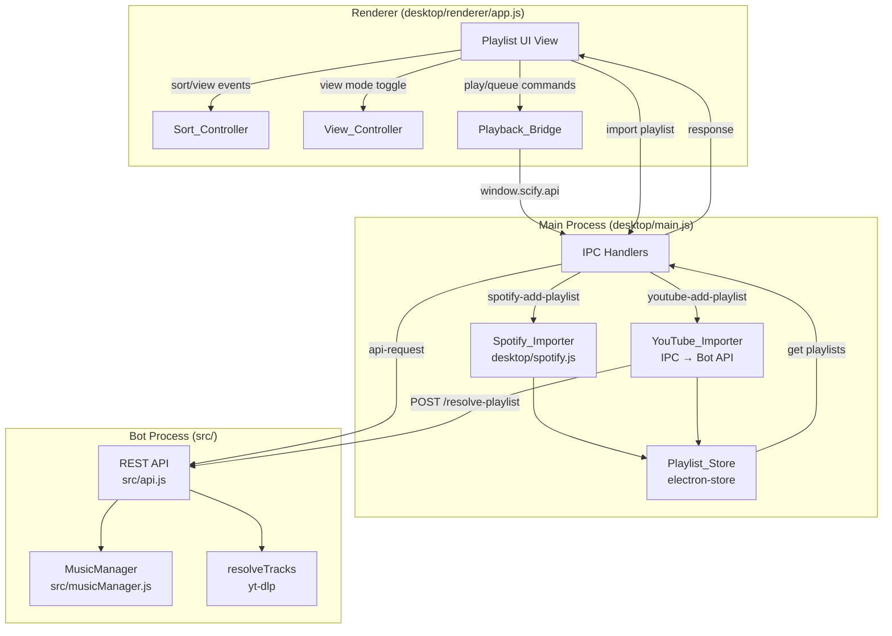

# Design Document: Playlist Management

## Overview

This design adds a comprehensive playlist management system to the Scify Music desktop app. Users can import playlists from Spotify and YouTube, browse tracks with rich metadata, sort by various criteria, switch between Compact and List view modes, and initiate playback (Play All, individual play, or add-to-queue) directly from the playlist view.

The feature extends the existing Electron IPC architecture, leveraging the established `desktop/spotify.js` scraper for Spotify imports, introducing a new YouTube importer backed by the bot's `resolveTracks` function, and integrating with the REST bridge (`src/api.js`) for playback commands.

### Key Design Decisions

1. **Shared Playlist_Store for both sources**: Both Spotify and YouTube playlists are stored in the same `electron-store` collection with a unified schema, distinguished by a `source` field. This simplifies the renderer logic and enables a single sorted/filtered view across all playlists.

2. **Sort logic lives in the renderer**: Sorting is a pure in-memory transformation of the current track array. No round-trip to the main process is needed, making view mode and sort switches instantaneous.

3. **Play All enqueues in current sort order**: When the user hits "Play All," the tracks are sent to the bot in whatever sort order is currently active, rather than always using original order. This matches user expectation of "play what I see."

4. **YouTube import via IPC → bot API → yt-dlp**: Rather than bundling yt-dlp in the Electron renderer, YouTube playlist resolution is delegated to the bot process through the existing REST bridge, keeping the desktop app lightweight.

## Architecture



## Components and Interfaces

### 1. Playlist_Store (Main Process)

Extends the existing `electron-store` instance in `desktop/main.js`.

```javascript
// Schema stored under 'playlists' key in electron-store
interface StoredPlaylist {
  id: string;            // Unique ID (Spotify playlist ID or YouTube playlist ID)
  name: string;
  description: string;
  coverUrl: string | null;
  source: 'spotify' | 'youtube';
  sourceUrl: string;     // Original import URL
  trackCount: number;
  tracks: StoredTrack[];
  syncedAt: number;      // Unix timestamp of last sync
}

interface StoredTrack {
  title: string;
  artist: string;
  album: string;         // Empty string if unavailable
  durationMs: number;    // Duration in milliseconds (0 if unknown)
  thumbnail: string | null;
  query: string;         // Search query for playback (e.g. "Artist - Title")
  addedAt: number;       // Timestamp when track was added/synced
}
```

**Methods (IPC handlers in main.js):**

| IPC Channel | Direction | Description |
|---|---|---|
| `playlist-import-spotify` | invoke | Import/refresh a Spotify playlist by URL |
| `playlist-import-youtube` | invoke | Import/refresh a YouTube playlist by URL |
| `playlist-get-all` | invoke | Return all stored playlists (without track arrays for list view) |
| `playlist-get-tracks` | invoke | Return full track list for a specific playlist ID |
| `playlist-remove` | invoke | Delete a playlist from the store |
| `playlist-get-view-mode` | invoke | Get persisted view mode preference |
| `playlist-set-view-mode` | invoke | Persist view mode preference |

### 2. Spotify_Importer (desktop/spotify.js)

Already exists. The `fetchPlaylistTracks(url)` function returns a playlist object. The design normalizes its output into the `StoredPlaylist` schema by mapping:
- `track.durationMs` from the existing `durationMs` field
- `track.album` defaulting to `''` (Spotify embed doesn't always provide album)
- `track.addedAt` set to `syncedAt` timestamp
- `track.query` from the existing `query` field (`"Artist - Title"`)

### 3. YouTube_Importer (new module: desktop/youtube.js)

A new module that resolves YouTube playlists by calling the bot's REST API.

```javascript
// desktop/youtube.js
export async function fetchYouTubePlaylist(url, apiRequest) {
  // Calls the bot's resolve endpoint which uses yt-dlp --flat-playlist
  const data = await apiRequest('POST', '/resolve-playlist', { url });
  return {
    id: data.playlistId,
    name: data.title,
    description: '',
    coverUrl: data.thumbnail || null,
    source: 'youtube',
    sourceUrl: url,
    trackCount: data.tracks.length,
    tracks: data.tracks.map(t => ({
      title: t.title,
      artist: t.artist || t.channel || '',
      album: '',
      durationMs: (t.durationSec || 0) * 1000,
      thumbnail: t.thumbnail || null,
      query: t.url || `${t.artist} - ${t.title}`,
      addedAt: Date.now(),
    })),
    syncedAt: Date.now(),
  };
}
```

**New bot API endpoint needed:** `POST /resolve-playlist`
- Input: `{ url: string }`
- Output: `{ playlistId, title, thumbnail, tracks: [{ title, artist, channel, durationSec, url, thumbnail }] }`
- Uses existing `ytDlpPlaylist()` from `musicManager.js`

### 4. Sort_Controller (Renderer)

A pure function module that sorts track arrays in-memory.

```javascript
// Sort options enum
const SORT_OPTIONS = ['custom', 'title', 'artist', 'album', 'recentlyAdded', 'duration'];

/**
 * Sort tracks by the given criterion.
 * @param {StoredTrack[]} tracks - Array of tracks (each with an originalIndex)
 * @param {string} criterion - One of SORT_OPTIONS
 * @returns {StoredTrack[]} New sorted array (does not mutate input)
 */
function sortTracks(tracks, criterion) { ... }
```

Sort rules:
- `custom` — sort by `originalIndex` ascending (import order)
- `title` — locale-aware alphabetical by `title`, ascending
- `artist` — locale-aware alphabetical by `artist`, ascending
- `album` — locale-aware alphabetical by `album`, ascending; tracks with empty album sort to end
- `recentlyAdded` — by `addedAt` descending (newest first)
- `duration` — by `durationMs` ascending (shortest first)

### 5. View_Controller (Renderer)

Manages view mode state and rendering strategy.

```javascript
const VIEW_MODES = ['list', 'compact'];

/**
 * Render a single track row based on the active view mode.
 * @param {StoredTrack} track
 * @param {number} index
 * @param {'list' | 'compact'} mode
 * @param {boolean} isPlaying - Whether this track is currently playing
 * @returns {string} HTML string for the track row
 */
function renderTrackRow(track, index, mode, isPlaying) { ... }
```

- **List mode**: Shows thumbnail (48×48), title, artist, album, duration. Standard row height (~56px).
- **Compact mode**: Shows title, artist, duration only. Reduced row height (~36px). No thumbnail.

### 6. Playback_Bridge (Renderer)

Handles sending play/queue commands to the bot via the existing `window.scify.api` proxy.

```javascript
/**
 * Play all tracks in the playlist starting from the first.
 * @param {StoredTrack[]} sortedTracks - Tracks in current sort order
 */
async function playAll(sortedTracks) {
  const { guildId, channelId } = state.settings;
  // Send first track as play, rest get enqueued by the bot
  for (const track of sortedTracks) {
    await window.scify.api.post('/play', { guildId, channelId, query: track.query });
  }
}

/**
 * Play a single track immediately.
 * @param {StoredTrack} track
 */
async function playTrack(track) {
  await window.scify.api.post('/play', { guildId, channelId, query: track.query });
}

/**
 * Add one or more tracks to the end of the current queue.
 * @param {StoredTrack[]} tracks - Tracks in display order
 */
async function addToQueue(tracks) {
  for (const track of tracks) {
    await window.scify.api.post('/play', { guildId, channelId, query: track.query });
  }
}
```

### 7. Preload API Extensions (desktop/preload.js)

New IPC methods exposed to the renderer:

```javascript
// Added to window.scify
playlistImportSpotify: (url) => ipcRenderer.invoke('playlist-import-spotify', url),
playlistImportYoutube: (url) => ipcRenderer.invoke('playlist-import-youtube', url),
playlistGetAll: () => ipcRenderer.invoke('playlist-get-all'),
playlistGetTracks: (id) => ipcRenderer.invoke('playlist-get-tracks', id),
playlistRemove: (id) => ipcRenderer.invoke('playlist-remove', id),
playlistGetViewMode: () => ipcRenderer.invoke('playlist-get-view-mode'),
playlistSetViewMode: (mode) => ipcRenderer.invoke('playlist-set-view-mode', mode),
```

## Data Models

### Playlist (electron-store persistence)

```json
{
  "playlists": [
    {
      "id": "37i9dQZF1DXcBWIGoYBM5M",
      "name": "Today's Top Hits",
      "description": "The biggest songs right now.",
      "coverUrl": "https://i.scdn.co/image/...",
      "source": "spotify",
      "sourceUrl": "https://open.spotify.com/playlist/37i9dQZF1DXcBWIGoYBM5M",
      "trackCount": 50,
      "tracks": [
        {
          "title": "Espresso",
          "artist": "Sabrina Carpenter",
          "album": "Short n' Sweet",
          "durationMs": 175000,
          "thumbnail": "https://i.scdn.co/image/...",
          "query": "Sabrina Carpenter - Espresso",
          "addedAt": 1719500000000
        }
      ],
      "syncedAt": 1719500000000
    }
  ],
  "playlistViewMode": "list",
  "playlistLastSort": "custom"
}
```

### Track Schema Defaults

When deserializing from storage, missing or null fields receive these defaults:

| Field | Type | Default |
|---|---|---|
| `title` | string | `""` |
| `artist` | string | `""` |
| `album` | string | `""` |
| `durationMs` | number | `0` |
| `thumbnail` | string \| null | `null` |
| `query` | string | `""` |
| `addedAt` | number | `0` |

## Correctness Properties

*A property is a characteristic or behavior that should hold true across all valid executions of a system — essentially, a formal statement about what the system should do. Properties serve as the bridge between human-readable specifications and machine-verifiable correctness guarantees.*

### Property 1: Playlist Persistence Completeness

*For any* valid playlist object (from either Spotify or YouTube source), persisting it to the Playlist_Store and then retrieving it SHALL return a playlist with all required fields present: id, name, coverUrl, source, sourceUrl, trackCount, tracks array, and syncedAt timestamp.

**Validates: Requirements 1.2, 2.2**

### Property 2: Playlist Upsert Idempotence

*For any* playlist that has been previously imported, re-importing the same playlist (same source URL) SHALL result in exactly one entry in the store with that playlist's ID, and the entry SHALL contain the updated data from the latest import.

**Validates: Requirements 1.4, 2.4**

### Property 3: Track Rendering by View Mode

*For any* valid track object, rendering it in "List" mode SHALL produce HTML containing the track's title, artist, album (when non-empty), formatted duration, and a thumbnail element; rendering the same track in "Compact" mode SHALL produce HTML containing title, artist, and formatted duration but SHALL NOT contain a thumbnail image element.

**Validates: Requirements 3.2, 5.2, 5.3**

### Property 4: Playlist Header Rendering

*For any* playlist with a non-null cover image, the rendered header SHALL contain the cover image URL, playlist name, track count, and source indicator (either "spotify" or "youtube").

**Validates: Requirements 3.4**

### Property 5: Sort Correctness — Alphabetical Fields

*For any* non-empty track list, applying "title" sort SHALL produce a list where each track's title is lexicographically ≤ the next track's title; applying "artist" sort SHALL produce a list where each track's artist is lexicographically ≤ the next track's artist.

**Validates: Requirements 4.3, 4.4**

### Property 6: Sort Correctness — Album with Grouping

*For any* non-empty track list containing tracks both with and without album names, applying "album" sort SHALL produce a list where: (a) all tracks with non-empty album appear before tracks with empty album, and (b) tracks with non-empty album are sorted alphabetically by album name.

**Validates: Requirements 4.5**

### Property 7: Sort Correctness — Recently Added (Descending)

*For any* non-empty track list, applying "recentlyAdded" sort SHALL produce a list where each track's `addedAt` timestamp is ≥ the next track's `addedAt` timestamp.

**Validates: Requirements 4.6**

### Property 8: Sort Correctness — Duration (Ascending)

*For any* non-empty track list, applying "duration" sort SHALL produce a list where each track's `durationMs` is ≤ the next track's `durationMs`.

**Validates: Requirements 4.7**

### Property 9: Sort Preserves Original Order

*For any* track list with assigned original indices, applying "custom" sort SHALL produce a list ordered by ascending original index, matching the source playlist's import order.

**Validates: Requirements 4.2**

### Property 10: Play All Enqueues in Sort Order

*For any* playlist with a given active sort criterion, triggering "Play All" SHALL send play commands to the bot API with track queries in the exact order produced by the active sort.

**Validates: Requirements 6.1**

### Property 11: Add to Queue Preserves Display Order

*For any* selection of tracks in a given display order, triggering "Add to Queue" SHALL append those tracks to the bot's queue in their displayed order (first displayed = first appended).

**Validates: Requirements 8.1, 8.3**

### Property 12: Serialization Round-Trip

*For any* valid playlist object (with any combination of non-null track fields), serializing to JSON and then deserializing SHALL produce an object deeply equal to the original.

**Validates: Requirements 9.1, 9.2, 9.3**

### Property 13: Deserialization Default Values

*For any* stored playlist JSON where track fields are missing or null, deserializing SHALL fill in defaults: empty string for text fields (`title`, `artist`, `album`, `query`), `0` for numeric fields (`durationMs`, `addedAt`), and `null` for optional URL fields (`thumbnail`).

**Validates: Requirements 9.4**

## Error Handling

| Scenario | Handler | User Feedback |
|---|---|---|
| Invalid Spotify URL (no playlist ID pattern match) | Spotify_Importer throws | Toast: "Invalid Spotify playlist URL. Please paste a link like https://open.spotify.com/playlist/..." |
| Private/deleted Spotify playlist | Spotify_Importer throws (404 or missing entity) | Toast: "Playlist not found — it may be private or deleted." |
| Invalid YouTube URL | YouTube_Importer throws | Toast: "Invalid YouTube playlist URL." |
| YouTube playlist unavailable | Bot API returns error | Toast: "Could not load YouTube playlist — it may be private or region-locked." |
| Bot offline during playback | API request fails (fetch throws) | Toast: "Bot is offline. Start the bot in Settings." |
| No guild/channel configured | Playback_Bridge checks settings | Toast: "No server configured. Go to Settings first." |
| Guild/channel unreachable | API returns 404 | Toast: "Bot is not in that server. Check Settings." |
| Network timeout during import | fetch throws after timeout | Toast: "Import timed out. Check your internet connection." |
| Corrupted stored playlist JSON | Playlist_Store deserializer catches parse error | Silent recovery: skip corrupted entry, log warning |

## Testing Strategy

### Unit Tests (Vitest)

Focus on pure logic that doesn't require Electron or network:

- **Sort_Controller**: Test each sort criterion with concrete examples, including edge cases (empty arrays, all-same values, special characters in titles, missing fields).
- **View_Controller rendering**: Test that `renderTrackRow` produces correct HTML for both modes with various track data.
- **Playlist normalization**: Test the mapping functions that convert Spotify/YouTube raw data into the unified `StoredPlaylist` schema.
- **Deserialization defaults**: Test that missing/null fields get correct defaults.
- **URL validation**: Test `extractPlaylistId` with valid/invalid Spotify URLs.

### Property-Based Tests (fast-check + Vitest)

The project already uses `fast-check` (v3.23.2) as a dev dependency. Each property test runs a minimum of 100 iterations.

Configuration:
- Library: `fast-check` (already installed in `desktop/package.json`)
- Runner: Vitest (already configured in `desktop/vitest.config.js`)
- Minimum iterations: 100 per property
- Each test tagged with: `Feature: playlist-management, Property {N}: {description}`

Properties to implement:
1. **Playlist Persistence Completeness** — generate random playlists, store and retrieve, verify all fields present.
2. **Playlist Upsert Idempotence** — import same playlist twice with different track data, verify single entry with latest data.
3. **Track Rendering by View Mode** — generate random tracks, render in both modes, verify field presence/absence.
4. **Playlist Header Rendering** — generate random playlists with covers, verify header contains all elements.
5. **Sort Correctness (alphabetical)** — generate random track lists, sort by title/artist, verify ordering invariant.
6. **Sort Correctness (album grouping)** — generate tracks with/without albums, verify partition and alphabetical order.
7. **Sort Correctness (recently added)** — generate tracks with timestamps, verify descending order.
8. **Sort Correctness (duration)** — generate tracks with durations, verify ascending order.
9. **Sort Preserves Original Order** — generate indexed tracks, verify custom sort restores indices.
10. **Play All Sort Order** — generate playlists, apply sort, mock API, verify call order matches sort.
11. **Add to Queue Display Order** — generate selections, mock API, verify append order.
12. **Serialization Round-Trip** — generate random valid playlists, JSON.stringify then parse, verify deep equality.
13. **Deserialization Defaults** — generate playlists with randomly nulled/deleted fields, deserialize, verify defaults.

### Integration Tests

- **Spotify import end-to-end** (mocked HTTP): Verify full flow from URL input → scrape → store → retrieve.
- **YouTube import end-to-end** (mocked bot API): Verify full flow from URL input → bot resolve → store → retrieve.
- **Playback bridge** (mocked API): Verify Play All, individual play, and add-to-queue send correct API calls.
- **View mode persistence**: Verify electron-store retains mode across simulated restarts.
